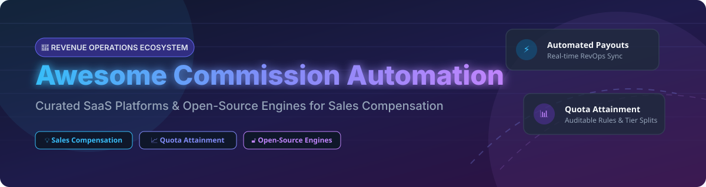

# 🚀 Awesome Commission Automation Platform

  
  
  
  

## 📊 Top Commission Automation Platforms & Incentive Compensation Software Ecosystem

**Curated List of Enterprise SaaS Products & Open-Source GitHub Projects**

*Focused on Sales Compensation, Incentive Management (ICM), Quota Attainment, Payout Processing & RevOps Workflows*

**Last updated: September 2026**

This repository tracks notable **SaaS platforms** and **open-source projects** for **Commission Automation**, **Sales Incentive Compensation Management (ICM)**, and **Quota Attainment Tracking**. These tools help revenue operations (RevOps) and sales finance teams calculate sales commissions accurately, manage multi-tier incentive compensation plans, track quota attainment, and process payouts—replacing error-prone spreadsheets with auditable, automated workflows.

---

## 📑 Table of Contents

- [🏢 SaaS / Hosted Platforms](#-saas--hosted-platforms)
- [🔓 Open-Source GitHub Projects](#-open-source-github-projects)
- [🤝 How to Contribute](#-how-to-contribute)
- [☕ Support & Sponsorship](#-support--sponsorship)
- [📈 Star History](#-star-history)
- [⚠️ Disclaimer](#%EF%B8%8F-disclaimer)

---

## 🏢 SaaS / Hosted Platforms

> 💡 **Market Insights:** The global Incentive Compensation Management (ICM) and Sales Commission Automation market is estimated at **$1.8B – $2.5B+** and is **moderately fragmented**, featuring established enterprise legacy suites (Xactly, Varicent), fast-growing mid-market leaders (CaptivateIQ, Spiff, Everstage), and emerging niche automation tools.

Below is a curated comparison of leading SaaS products, sorted by **Market Cap / Valuation / Revenue** in descending order:

| 🏢 Platform | 💰 Enterprise Metric (Valuation / Revenue) | 🏷️ Starting Pricing Tier | 🎁 Free Tier / Trial Limit | 📝 Key Highlights & Description |
| :--- | :--- | :--- | :--- | :--- |
| **[Xactly](https://www.xactlycorp.com/)** | **~$2.0B Valuation** (Acquired by Vista Equity) | **$50 / user / month** (billed annually) | ⚡ 14-day demo environment upon enterprise sales request | Enterprise sales performance management, AI-driven sales planning, and scalable incentive compensation management for large global enterprises. |
| **[Varicent](https://www.varicent.com/)** | **~$1.5B Valuation** (Acquired by Great Hill Partners) | **$45 / user / month** (billed annually) | ⚡ 14-day guided sandbox access upon sales qualification | Enterprise incentive compensation and sales performance management platform with advanced analytics, modeling, and workflow automation. |
| **[Spiff](https://www.spiff.com/)** | **~$1.25B Valuation** (Acquired by Salesforce for $1.15B+) | **$60 / user / month** (billed annually) | ⚡ 14-day interactive guided demo trial | Real-time sales commission automation platform with intuitive plan building, CRM integration (Salesforce native), and rep-facing dashboards. |
| **[CaptivateIQ](https://www.captivateiq.com/)** | **$1.25B Valuation** (Series C funding) | **$40 / user / month** (billed annually) | ⚡ 14-day interactive trial on request (No permanent free tier) | No-code commission platform replacing spreadsheets with flexible plan modeling, custom logic, real-time rep visibility, and ERP/CRM sync. |
| **[Everstage](https://www.everstage.com/)** | **~$120M Valuation** ($30M+ total funding raised) | **$35 / user / month** (billed annually) | ⚡ 7-day free sandbox trial with sample data | No-code sales commission and incentive compensation platform enabling RevOps teams to construct complex commission structures and manage disputes. |
| **[Performio](https://www.performio.co/)** | **~$80M Valuation** ($15M+ ARR) | **$40 / user / month** (billed annually) | ⚡ 14-day sales demo environment | Sales commission software tailored for mid-market and enterprise teams, featuring robust governance, automated calculations, and reporting. |
| **[Qobra](https://www.qobra.co/)** | **~$50M Valuation** (€10M+ funding raised) | **$30 / user / month** (€27/user/mo billed annually) | ⚡ 14-day free trial environment | Modern European commission automation platform with real-time rep dashboards, automated payout calculations, and dispute resolution. |
| **[QuotaPath](https://www.quotapath.com/)** | **~$40M Valuation** ($21.3M total funding raised) | **$35 / user / month** (Growth plan + base platform fee) | ⚡ 30-day free trial (Up to 3 users, 1 plan, standard CRM sync) | Commission tracking and quota attainment platform for scaling sales teams with customizable compensation plans and CRM integrations. |
| **[Compass](https://www.compass.com/)** | **~$35M Valuation** (Xoxoday Compass ICM platform) | **$25 / user / month** (billed annually) | ⚡ 14-day free trial (Up to 10 users & sample sales data) | Commission management and gamified sales incentive platform supporting commission calculation, milestone tracking, and payout processing. |
| **[SalesCookie](https://salescookie.com/)** | **~$15M Valuation** (Bootstrapped / Profitable) | **$40 / user / month** (Business plan) | ⚡ 14-day full-featured free trial (100k transactions, 25 plans limit) | Web-based sales commission management software offering flexible pay-as-you-go pricing, quota management, and automated payout calculations. |

---

## 🔓 Open-Source GitHub Projects

The open-source ecosystem provides transparent calculation engines, self-hosted web applications, and frameworks for custom commission rules.

Below are top open-source projects, sorted by **GitHub Star Count** in descending order:

| 📦 Repository / Project | ⭐ GitHub Stars | 🛠️ Tech Stack | 📝 Key Features & Description |
| :--- | :--- | :--- | :--- |
| **[OCA/commission](https://github.com/OCA/commission)** |  | Python / Odoo ERP | **Comprehensive Odoo ERP commission management system.** Provides flexible commission agent assignment, settlement management, formulas, and payout workflows. |
| **[mkeremcansev/laravel-commission](https://github.com/mkeremcansev/laravel-commission)** |  | PHP / Laravel | **Flexible Laravel package to calculate and log commissions.** Supports percentage, fixed amount, dynamic calculations based on price, and Eloquent integration. |
| **[ibizabroker/sales-incentive-management-platform](https://github.com/ibizabroker/sales-incentive-management-platform)** |  | JavaScript / Node.js | **Sales incentive management web application.** Built to handle multi-region, multi-product compensation models and sales rep tracking. |
| **[prathammahajan13/affiliate-management-system](https://github.com/prathammahajan13/affiliate-management-system)** |  | Node.js / Express | **Production-ready affiliate management system.** Supports multi-tier commission structures (Bronze 10% → Platinum 25%), volume bonuses, and fraud detection. |
| **[Nguyen-Anh-Don/Shopee-Commission-Order-Calculator](https://github.com/Nguyen-Anh-Don/Shopee-Commission-Order-Calculator)** |  | JavaScript / Chrome Ext | **Shopee Affiliate commission calculation extension.** Tracks clicks, orders, commission statistics, sub-ID breakdowns, and CPC profit metrics. |
| **[ayangzy/laravel-sales-commission](https://github.com/ayangzy/laravel-sales-commission)** |  | PHP 8.2+ / Laravel 11 | **Full lifecycle sales commission package.** Supports team splits, clawbacks, automatic tier progression (Bronze → Gold), payout schedules, and event hooks. |
| **[jjeanius/rails_project_sales_commission_application](https://github.com/jjeanius/rails_project_sales_commission_application)** |  | Ruby on Rails | **Ruby on Rails sales commission app.** Simple web application for tracking sales team quotas, transactions, and calculating total commission earnings. |
| **[Estevan-Z/CommissionPro](https://github.com/Estevan-Z/CommissionPro)** |  | Python / Django | **Intuitive sales commission platform.** Features product catalog management, sales order tracking, and automated commission calculations. |
| **[amastin-microcenter/Commission-Calculator](https://github.com/amastin-microcenter/Commission-Calculator)** |  | Python | **Hourly wage and retail sales commission calculator.** Handles department-specific commission rules, transaction items, and earnings estimations. |
| **[esdecode/seller-earnings-calculator](https://github.com/esdecode/seller-earnings-calculator)** |  | TypeScript | **Open-source engine for marketplace seller earnings.** Calculates marketplace fees, VAT, refund deductions, payment processing costs, and net revenue. |
| **[2hot4you/XCLOUD](https://github.com/2hot4you/XCLOUD)** |  | Go / Gin / PostgreSQL | **Automated multi-cloud reconciliation platform.** Provides real-time commission calculations for public cloud resellers (AWS, Alibaba Cloud, Tencent Cloud). |
| **[ZhuaTech COMM](https://jihulab.com/zhihua-tech/zhuatech-commission)** | 🏢 *JiHuLab Enterprise* | Java 21 / Spring Boot / Vue 3 | **Enterprise sales incentive system.** Features persisted run batches, multi-person split attribution, cap enforcement, review gates, and clawback audits. |
| **[@lacspace/commission](https://www.npmjs.com/package/@lacspace/commission)** | 📦 *375k+ Weekly Downloads* | TypeScript / Isomorphic | **Zero-dependency TypeScript calculation engine.** Supports marginal-tier/progressive-slab rules and exact marketplace splits using integer minor units (cents). |
| **[tebwritescode/sales-tracker](https://hub.docker.com/r/tebwritescode/sales-tracker)** | 🐳 *Docker Hub Image* | Python / Flask / SQLite | **Sales tracking and commission analytics web app.** Features employee draw management, CSV bulk import, Chart.js analytics, and Docker support. |

---

## 🤝 How to Contribute

Contributions are warmly welcomed! Help us keep this ecosystem list up-to-date and complete:

1. 🍴 **Fork** this repository.
2. 📝 **Add or update** entries in `README.md` maintaining table formatting.
3. 🔎 Ensure descriptions are factual, pricing is specified, and GitHub repo links are valid.
4. 🚀 **Submit a Pull Request** with a brief summary of your changes.

Check out our reference lists on [Awesome-Awesome-Awesome](https://github.com/ishandutta2007/Awesome-Awesome-Awesome).

---

## ☕ Support & Sponsorship

If you find this curated ecosystem list useful for your RevOps team or engineering project, please consider supporting the project:

- ⭐ **Star** this repository to show your support and help others discover it!
- 🔀 **Fork** it to keep your own curated version.
- 📢 **Share** it on LinkedIn, Twitter/X, or RevOps communities.
- 💖 **Sponsor the Maintainer:** Consider buying a coffee to support open-source maintenance via [GitHub Sponsors Dashboard](https://github.com/sponsors/ishandutta2007).

---

## 📈 Star History

---

## ⚠️ Disclaimer

- This list is **community-curated** for informational and educational purposes — it does not constitute financial advice or product endorsement.
- Sales commission automation systems handle sensitive payroll, revenue, and compensation data; ensure strict compliance with internal security policies and local labor laws.
- The open-source commission automation space is growing rapidly; evaluate security, test coverage, and licensing terms before deploying in production environments.

---

  <b>Made with ❤️ for Revenue Operations (RevOps) Teams, Sales Finance Managers, and Compensation Engineers.</b>

